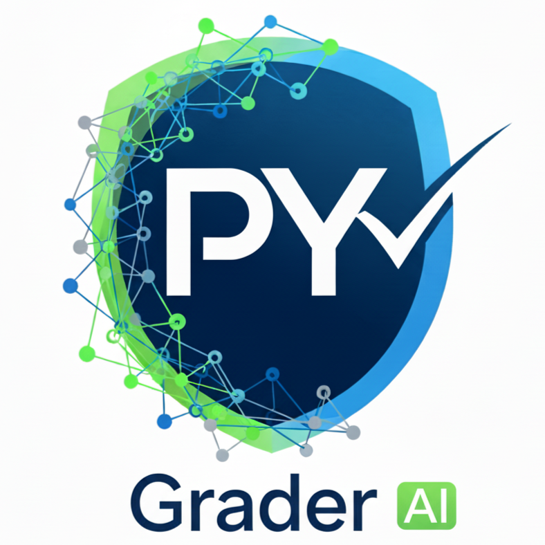

[](https://muntisa.github.io/py-grader-ai/)
[](https://doi.org/10.5281/zenodo.18177182)

# Py-Grader AI - AI-Powered Python Programming Exam Evaluation for Professors

**Py-Grader AI** is a modern, single-page web application designed to automate the evaluation of Python programming exams using the power of Google's **Gemini 2.0 Flash AI**. It provides a streamlined workflow for professors to grade multiple student submissions with consistent, high-quality feedback and detailed scoring.



## 🚀 Key Features

*   **AI-Driven Evaluation**: Utilizes Google's cutting-edge **Gemini 2.0 Flash Exp** API for superior code understanding and reasoning.
*   **Three-Phase Workflow**:
    1.  **Criteria Generation**: Automatically generates a strict grading rubric based on your exercise context.
    2.  **Automated Grading**: Evaluates student code against the rubric, checking for correctness, style, and efficiency.
    3.  **Report Generation**: Produces downloadable detailed text reports and CSV summary files.
*   **Smart Criteria Editor**: Review and modify the AI-generated grading criteria before applied to students.
*   **Evaluation Viewer**: interactive side-by-side viewer to inspect the AI's annotated feedback vs. the student's original code.
*   **Deterministic Grading**: Configured with strict model parameters (Temperature 0.0) to ensure consistent, fair grading across attempts.
*   **Local & Secure**: Runs entirely in your browser. API keys are stored locally and files are processed on your machine.
*   **Resilient Architecture**: Built-in rate limiting and auto-retry logic to handle API quotas smoothly.
*   **Multi-Language Support**: Fully localized interface and AI feedback in **English**, **Spanish**, **Galician**, and **Romanian**. Select your preferred language directly from the header.
*   **Most importantly: academic responsibility always stays with the professor** — aligning with the European Union’s *Explainable AI in education* principles, which highlight the need for **human oversight and shared responsibility** in AI-assisted educational tools (see Publications Office of the EU report: [https://op.europa.eu/en/publication-detail/-/publication/0020c74c-7402-11f0-9af8-01aa75ed71a1/language-en](https://op.europa.eu/en/publication-detail/-/publication/0020c74c-7402-11f0-9af8-01aa75ed71a1/language-en)).

## 📋 Prerequisites

*   A modern web browser (Chrome, Edge, or Firefox).
*   A **Google Gemini API Key**. You can get one for free at [Google AI Studio](https://aistudio.google.com/).
*   Student submissions organized in a directory (one folder per student containing their `.py` file).

## 🛠️ How to Use

1.  **Launch the App**: Simply open `index.html` in your web browser.
2.  **Configuration**:
    *   **API Key**
        - Paste your Google Gemini API key
        - It's stored locally in your browser for convenience
        - Never transmitted anywhere except to Google's API
3.  **Load Files**:
    *   **Root Directory**
        - Enter the path to your submissions folder
        - OR click "Browse for Folder" to select it graphically
        - Expected structure:
          ```
          Submissions/
          ├── Student_1/
          │   └── main.py
          ├── Student_2/
          │   └── solution.py
          └── ...
          ```
    *   **Exercise Description**: Paste or load the exam problem statement/requirements.
    *   **Professor's Solution**
        - Paste or load your reference solution code.
		- Use "Auto-Generate Solution" to obtain a Python code proposal from Gemini AI.
4.  **Start Evaluation**:
    *   The system will first generate a grading rubric.
    *   **Review Phase**: Edit the rubric if necessary and confirm.
    *   **Grading Phase**: The app will iterate through all students.
5.  **View Results**:
    *   Download the `pyGrader-[FolderName]_grading_details.txt` (detailed grading) and `pyGrader-[FolderName]_only_grades.csv` (gradebook).
    *   Use the **Evaluation Viewer** at the bottom to inspect specific student results.

## 📂 Output Files

Reports are saved to your **Download folder** with localized filenames corresponding to your selected language:

*   **`pyGrader-[FolderName]_grading_details.txt`** (or `_detalles_calificacion.txt`, etc.): A comprehensive report containing grades, deductions, and fully annotated code for every student.
*   **`pyGrader-[FolderName]_only_grades.csv`** (or `_solo_notas.csv`, etc.): A spreadsheet-friendly format listing Student Name, Final Grade, and Deduction Summaries.
*   **`pyGrader-[FolderName]_grading_criteria.md`** (or `_criterios_calificacion.md`): The finalized rubric used for the session.

## 🏗️ Technical Details

*   **Stack**: Vanilla HTML5, CSS3, JSON, and JavaScript (ES6+).
*   **Styling**: Modern, responsive dark UI using CSS Variables and Flexbox/Grid.
*   **API**: Direct integration with Google Generative Language API (REST).

## 👥 Credits & Affiliations

*   **Research Groups**: RNASA, CITIC, UDC
*   **Author**: Cristian R Munteanu

---
*Disclaimer: This tool is an assistant for grading. While strictly prompt-engineered for accuracy, final grades should always be reviewed by a human instructor.*
